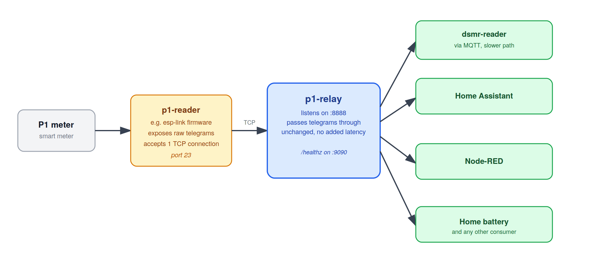

# p1-relay


TCP relay for DSMR/P1 telegrams. One upstream connection, many consumers. It's
lightweight, runs as a non-root user, and passes telegrams through untouched so
consumers see them the moment the meter sends them. For example it is seconds
sooner than the same data routed through
[dsmr-reader](https://github.com/dsmrreader/dsmr-reader) and out over MQTT.

<p align="left">
  
</p>

A P1 reader running [esp-link](https://github.com/jeelabs/esp-link) accepts only
one TCP connection at a time. Point p1-relay at the reader and it fans the
telegram stream out to as many programs as you like, for example: dsmr-reader,
Home Assistant, Node-RED, a home battery, all at once.

Any reader that exposes raw telegrams over TCP will work but I use the
[SlimmeLezer](https://www.zuidwijk.com/product/slimmelezer/) by Marcel Zuidwijk
([@zuidwijk](https://github.com/zuidwijk)), flashed with the esp-link firmware
offered on its product page rather than the default
[ESPHome build](https://github.com/zuidwijk/dsmr). ESPHome parses the telegram
on the device and does not hand out the raw stream.

## Run it

```sh
podman run -d --name p1-relay \
  -e UPSTREAM_HOST=192.168.1.50 \
  -p 8888:8888 \
  ghcr.io/OWNER/p1-relay:latest
```

Then point your programs at port `8888` instead of the reader itself. Disconnect
any existing consumer from the reader first because it can only serve one.

Verify with:

```sh
nc localhost 8888 | head -40
```

## Configuration

All settings are environment variables. `UPSTREAM_HOST` is the only required
one.

| Variable        | Default | Description              |
| --------------- | ------- | ------------------------ |
| `UPSTREAM_HOST` | —       | Address of the P1 reader |
| `UPSTREAM_PORT` | `23`    | Port of the P1 reader    |
| `LISTEN_ADDR`   | `:8888` | Where consumers connect  |
| `HEALTH_ADDR`   | `:9090` | Serves `/healthz`        |
